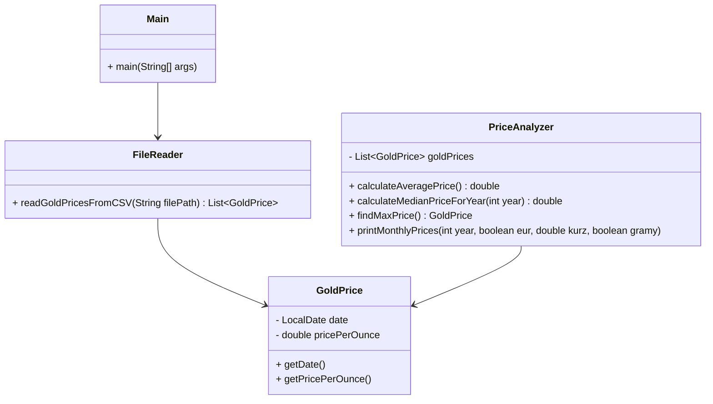
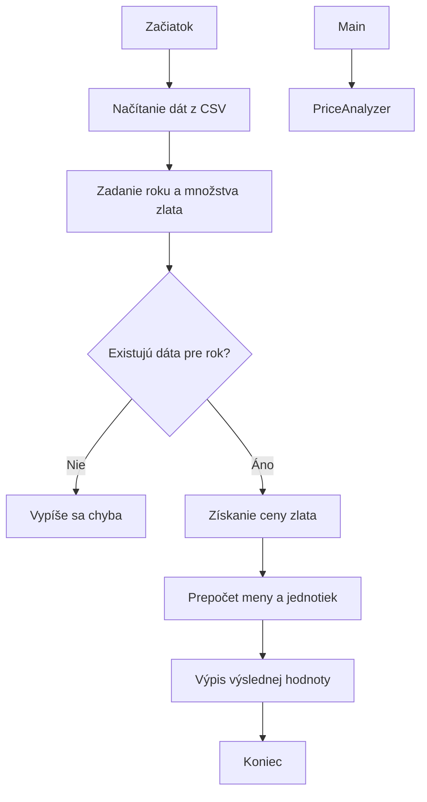

# Analýza ceny zlata

## Popis projektu
Tento projekt je konzolová aplikácia v jazyku Java, ktorá slúži na analýzu historických cien zlata.
Aplikácia pracuje s dátami uloženými v CSV súbore a umožňuje používateľovi vykonávať rôzne analýzy
pomocou textového menu.

## Použité technológie
- Java
- IntelliJ IDEA
- Git a GitHub
- CSV súbor
- Mermaid (UML diagram, Flowchart)

## Funkcionality programu
Program umožňuje:
- načítať historické ceny zlata z CSV súboru
- vypísať mesačné ceny zlata v zadanom roku
- vypočítať priemer a medián cien v zadanom roku
- nájsť maximálnu cenu zlata a jej dátum
- vypočítať hodnotu majetku ku dnešnému dňu na základe nákupu zlata

Ovládanie programu prebieha pomocou textového menu v konzole.

## UML Diagram tried

# FLOWCHART – VÝPOČET HODNOTY ZLATA

## Vývojový diagram výpočtu hodnoty zlata

