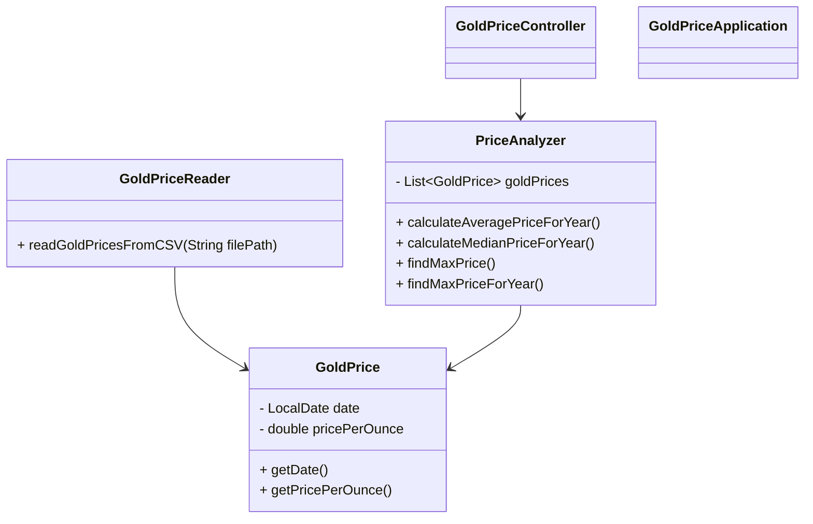
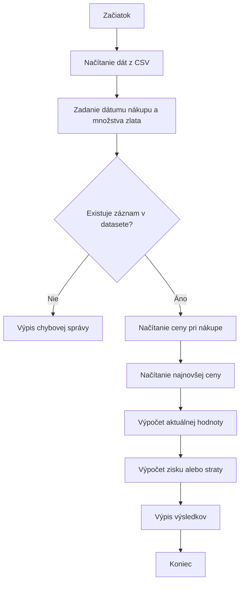

# Analýza ceny zlata

## Popis projektu

Analýza ceny zlata je desktopová aplikácia vytvorená v jazyku Java s využitím JavaFX. Program slúži na analýzu historických cien zlata načítaných z CSV súboru. Používateľ môže prostredníctvom grafického rozhrania vykonávať rôzne analýzy a sledovať vývoj cien zlata v čase.

Aplikácia umožňuje pracovať s cenami zlata v rôznych menách a jednotkách, zobrazovať graf vývoja cien a vypočítať hodnotu investície do zlata na základe zvoleného dátumu nákupu.

## Použité technológie

* Java
* JavaFX
* FXML
* CSS
* IntelliJ IDEA
* Git a GitHub
* CSV súbor
* Mermaid (UML diagram, Flowchart)

## Architektúra projektu

Projekt využíva architektúru MVC (Model – View – Controller).

### Model

* GoldPrice
* PriceAnalyzer
* GoldPriceReader

### View

* gold_price_view.fxml

### Controller

* GoldPriceController

## Funkcionality programu

Program umožňuje:

* načítať historické ceny zlata z CSV súboru
* zobraziť mesačné ceny zlata v zadanom roku
* vypočítať priemernú cenu zlata v zadanom roku
* vypočítať medián ceny zlata v zadanom roku
* nájsť maximálnu cenu zlata v celom datasete
* nájsť maximálnu cenu zlata v zadanom roku
* vypočítať hodnotu investície podľa dátumu nákupu
* zobraziť graf vývoja ceny zlata
* prepínať medzi svetlým a tmavým režimom
* pracovať s menami USD a EUR
* pracovať s jednotkami unca (oz) a gram (g)

## Ovládanie programu

Používateľ zadá požadované údaje do grafického rozhrania aplikácie a následne pomocou tlačidiel vykonáva jednotlivé analýzy. Výsledky sa zobrazujú v textovom výstupe a vybrané údaje je možné zobraziť aj vo forme grafu.

## Spustenie projektu

1. Otvoriť projekt v IntelliJ IDEA.
2. Nastaviť JDK 21.
3. Uistiť sa, že sú správne nastavené JavaFX knižnice.
4. Spustiť triedu `Main.java`.
5. Aplikácia sa otvorí v samostatnom JavaFX okne.

## UML Diagram Tried

```mermaid
classDiagram
    class GoldPrice {
        - LocalDate date
        - double pricePerOunce
        + getDate()
        + getPricePerOunce()
    }

    class GoldPriceReader {
        + readGoldPricesFromCSV(String filePath)
    }

    class PriceAnalyzer {
        - List~GoldPrice~ goldPrices
        + calculateAveragePriceForYear()
        + calculateMedianPriceForYear()
        + findMaxPrice()
        + findMaxPriceForYear()
    }

    class GoldPriceController

    class GoldPriceApplication

    GoldPriceReader --> GoldPrice
    PriceAnalyzer --> GoldPrice
    GoldPriceController --> PriceAnalyzer
```

# FLOWCHART – VÝPOČET HODNOTY ZLATA

## Vývojový diagram výpočtu hodnoty investície

```mermaid
flowchart TD
    A[Začiatok] --> B[Načítanie dát z CSV]
    B --> C[Zadanie dátumu nákupu a množstva zlata]
    C --> D{Existuje záznam v datasete?}
    D -- Nie --> E[Výpis chybovej správy]
    D -- Áno --> F[Načítanie ceny pri nákupe]
    F --> G[Načítanie najnovšej ceny]
    G --> H[Výpočet aktuálnej hodnoty]
    H --> I[Výpočet zisku alebo straty]
    I --> J[Výpis výsledkov]
    J --> K[Koniec]
```